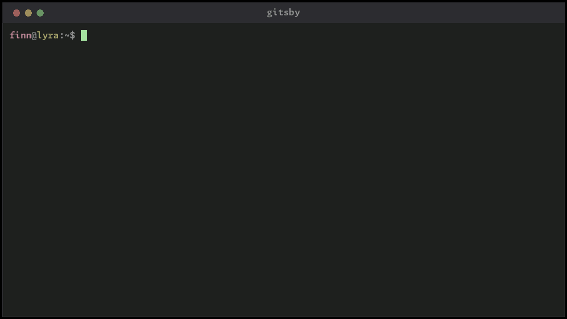

<!-- markdownlint-disable MD007 -- Unordered list indentation -->
<!-- markdownlint-disable MD010 -- No hard tabs -->
<!-- markdownlint-disable MD033 -- No inline html -->
<!-- markdownlint-disable MD055 -- Table pipe style [Expected: leading_and_trailing; Actual: leading_only; Missing trailing pipe] -->
<!-- markdownlint-disable MD041 -- First line in a file should be a top-level heading -->

<!-- TOC ignore:true -->
# Gitsby

<table style="border: none; border-collapse: collapse;">
	<tr style="border: none; border-collapse: collapse;">
		<td style="border: none; border-collapse: collapse;"></td>
		<td style="border: none;">A simple, safe, opinionated Git wrapper for everyday work: ten commands instead of eighty-odd, and a workflow the tool enforces rather than a convention you're asked to remember.  Every command that changes anything shows you the exact Git it will run, and asks first.  It also knows which of your GitHub accounts owns which folder, so work and personal repos stay separate.</td>
	</tr>
</table>

<!-- Pin to the gif's native 960px. GitHub's max-width:100% still shrinks it on narrow columns; a % width would blow it up past native on wide ones. -->
 
<i>Like the smooth-scrolling terminal output and cursor? Take a look at <a href="https://github.com/jim-collier/silkterm">SilkTerm</a>!</i>

<!--
	Demo video: https://www.youtube.com/watch?v=REPLACE_WITH_VIDEO_ID
	
-->

<!-- TOC ignore:true -->
## Table of contents

<!-- TOC -->

- [What it is](#what-it-is)
- [Commands](#commands)
- [Multiple GitHub accounts](#multiple-github-accounts)
- [Compatibility](#compatibility)
- [A typical day](#a-typical-day)
- [Install](#install)
	- [Is it in my package manager?](#is-it-in-my-package-manager)
	- [The one-liners](#the-one-liners)
	- [Where it goes](#where-it-goes)
	- [Without the installer](#without-the-installer)
	- [Or check it yourself](#or-check-it-yourself)
	- [Coming from 2.x](#coming-from-2x)
- [How to develop](#how-to-develop)
- [Contributing](#contributing)
- [Support Gitsby](#support-gitsby)
- [Legal stuff](#legal-stuff)

<!-- /TOC -->

## What it is

Git has more than eighty porcelain commands, because it supports every workflow, every team size, and every hard edge-case of conflict resolution. That flexibility is the whole reason it's complex.

Gitsby has ten - or 24 counting subcommands. It gets there three ways:

- By applying one opinionated workflow and ignoring the myriad other ways of doing the same thing.

- By accepting that arguably 90% of Git's complexity covers about 10% of use-cases, and purposely leaving those alone. Not pretending they never happen - just not trying to be the tool that solves them when they do.

- By orienting commands around *goals* ("what do I want to happen with these changes?") rather than around administrative tasks. So Gitsby commands don't map 1:1 onto Git commands; they line up with what you were actually trying to do, which is usually several Git commands and a decision or two in between.

Gitsby does nothing a skilled Git user can't do directly - just with far fewer chances to make one of the expensive mistakes.

Every command aims to be safe (never risk losing work, yours or anyone's), idempotent, tolerant of a previous command having been half-finished, and forgiving - run any of them at any time, and if it doesn't make sense it won't damage anything.

Three things it holds to everywhere:

- **It shows its work.** Every command that changes anything prints the repo state, then the exact Git commands it is about to run, then asks. Nothing happens that you didn't read first.

- **It keeps no state of its own.** No database, no metadata, no dotfile in your repo. Everything it knows, it asks Git and `gh` for, every run. Stop using it mid-project and there is nothing to undo.

- **It is one file.** A static binary: no runtime, no interpreter, nothing installed alongside it. Uninstalling is deleting it.

The full list of opinions, and how the workflow lines up against GitFlow, GitHub Flow, GitLab Flow, and trunk-based development, is in [workflows.md](workflows.md).

## Commands

What you reach for daily is a one-word command. Everything else is grouped under a noun, so the whole set is discoverable from a handful of starting points. `repository` and `branch` spell out if you prefer them.

| Command              | Args          | What it does
| :--                  | :--           | :--
| `pullcom`            | `[msg]`       | Pull updates, then commit all local changes. Do frequently!
| `sync`               | `[msg]`       | Pull, commit, and push. Do infrequently.
| `status`             |               | Fetch and show current status.
| `whoami`             |               | Show who commands in this folder act as: account, ssh key, commit author, git host login.
| `release`            | `[ver]`       | Cut a release: merge `dev` into `main`, tag, push. No version: the next one after the latest tag.
| `br`                 |               | Fetch and list branches (`br list` is the same thing).
| `br create`          | `<branch>`    | Create a new branch off `dev`/`main`. Uncommitted work on `dev`/`main` comes along; on another branch it is parked there first.
| `br hotfix`          | `<name>`      | Branch off the default branch as `hotfix/<name>`, to correct what's already published. Landing it carries the change back to `dev`.
| `br switch`          | `[branch]`    | Switch to a branch (parks current work first). No arg: back to `dev`/`main`.
| `br merge`           | `[msg]`       | Merge the current branch into `dev`/`main` (`--no-ff`), push, delete it local + remote.
| `br prune`           |               | Delete branches already merged into `dev`/`main`, local + remote. Unmerged ones, and the branch you're on, are kept.
| `repo clone`         | `<url> [dir]` | Clone a repo you don't have yet (checks out `dev` if it has one). Re-run is a no-op.
| `repo create`        | `<owner/name>`| `git init` if needed, commit, then create the GitHub repo via [gh](https://github.com/cli/cli) and push to it (`--public`/`--private`; private by default).
| `repo connect`       | `[target]`    | Publish local work to a remote that already exists and is empty: `git init` if needed, commit, push. Takes a URL or `owner/name`.
| `repo url`           | `[https\|ssh]` | Show how `origin` authenticates, or switch it between the two. Nothing else about the repo changes.
| `pr`                 |               | Lists PRs, via [gh](https://github.com/cli/cli) on GitHub or [tea](https://gitea.com/gitea/tea) on Gitea.
| `pr <#>`             |               | View a PR plus its diff.
| `pr create`          | `[title]`     | Push the current branch and open a PR against `dev`/`main` (no title: the last commit subject).
| `pr ok`              | `<#>`         | Approve and merge a PR.
| `account`            |               | Show your configured GitHub accounts, and which one this folder uses (`account list` is the same thing).
| `account set`        | `<a> <k> <v>` | Set one key of one account in the accounts file, e.g. `account set work path ~/dev/work`. Run it bare for the keys it takes.
| `account apply`      |               | Teach plain `git` the same folder rules, so `git` outside Gitsby behaves identically.
| `raw git`            | `<args ...>`  | Run `git` as the account this folder belongs to. Everything after `git` is git's, verbatim.
| `raw gh`             | `<args ...>`  | The same, for `gh`.

`pullcom` was once called `update`, and `br merge` was `br land`. The old spellings still work and always will, so nothing you have typed or scripted stops working. `pullcom` also answers to `pull`, and to anything between it and the full word.

There is deliberately no bare `commit`, and no bare `pull` that skips the commit. Committing without sharing is how work quietly diverges, and pulling without committing is the one thing the rest of the tool never does - which is why `pull` is a spelling of `pullcom` rather than a command of its own.

`br create`, `br switch`, `br merge`, and `pr create` all deal with your work first. `pullcom` is the one command for both, and it pulls *before* it commits so your work lands on top of everyone else's and history stays linear.

`br prune` deletes a branch only when its tip is provably an ancestor of the merge target, re-checked at the moment of each delete - not `git branch -d`'s upstream-containment test, which answers a different question and gets it wrong in both directions. That exactness is what the workflow buys: every branch lands with a real merge commit, so "merged" is a fact, not a guess. Unmerged work always survives it, and there is deliberately no `--force`.

Options: `-m MSG` (commit/merge message, or give it positionally), `-q`/`-y` (assume yes; no prompts), `--public`/`--private` (visibility for `repo create`; private by default), `--no-fetch` (skip the fetch and the pull), `--any-identity`, `--config FILE` (read accounts from somewhere other than the usual place), `-h`, `-v`.

**Offline is a state, not a flag.** Every command finds out by trying, and then behaves:

- The ones that mean something locally still work. `pullcom` commits; `br create`, `br switch` and `br merge` do their branch work. Each says what it skipped, and that `sync` will publish it later.

- The ones that exist to publish - `sync`, `pr create`, `pr ok`, `release` - refuse up front and say what to do instead. None of them fails halfway through, and none reports success having sent nothing.

**Publishing a directory shows you the directory first.** `repo create` and `repo connect` list every file they are about to publish, before asking. The list is what `git add --all` will actually add, `.gitignore` and all - so a stray `.env` is visible while you can still say no.

## Multiple GitHub accounts

Most people with two GitHub accounts also have a folder for each: one tree for work, one for everything else. Gitsby takes that literally. Say which account owns which folder, once, and every command run anywhere under that folder acts as that account - `git` and `gh` alike.

~~~ini
# ~/.config/gitsby/config.shcl

account.work.path       = ~/dev/work
account.work.ghAccount  = my-work-login
account.work.email      = ada@work.example

# Or name folders instead of a root, and the same file works on every machine
account.personal.pathContains = github.com/my-personal-login
account.personal.ghAccount    = my-personal-login
account.personal.email        = ada@home.example
~~~

Over HTTPS each account authenticates with its own token - the one `gh` already stores. A second account costs one `gh auth login` and three lines of config: no SSH keys, no `~/.ssh/config` host aliases baked into remote URLs.

Two things follow from that, and they are the reason to bother:

- `gitsby account apply` writes the same folder rules into your global Git config, as ordinary `includeIf` blocks. Plain `git` then agrees with Gitsby even when Gitsby isn't involved.

- `gitsby raw git ...` runs any Git command as the folder's account. Existing scripts become account-correct by prefixing them, not by rewriting them.

Nothing here is required. With no configuration Gitsby uses whichever account `gh` is logged in as, exactly as it always did. A single-account machine never notices the feature exists.

Full detail, including where the file lives on each platform, SSH keys, token files, and how Gitsby checks that `gh` and `git` agree about who you are: [accounts.md](accounts.md).

## Compatibility

- Gitsby, [Git](https://git-scm.com/), [gh](https://github.com/cli/cli), [Lazygit](https://github.com/jesseduffield/lazygit), and [Tig](https://github.com/jonas/tig) are all compatible, interchangeable, and can be intermixed on the same project at any time without interference. That makes trying Gitsby cheap - you don't need to commit to anything. (No pun intended.)

	> Note: [GitButler](https://gitbutler.com/) is *not* interchangeable with these. While a great tool and a cool idea, it manages its own metadata - that inherently doesn't mix well with other git-based tools that move `HEAD` or rewrite history. It's worth a look, but give it a dedicated trial on a small personal repo rather than mixing it in.

- Gitsby works with any Git remote. Nearly everything it does is Git, and Git does not care whose server it is - branching, committing, pulling, pushing, merging, pruning and releasing need no account with anybody.

- Gitsby looks at where `origin` actually points before reaching for anything else, so a host-specific tool is only ever run against the host it serves. On GitHub that is [gh](https://github.com/cli/cli); on Gitea and Forgejo it is [tea](https://gitea.com/gitea/tea) (some distributions install it as `tea-cli` - either name is found). Neither installed is fine until you ask for something that needs one, and then it says which one and why.

- Still GitHub-only, because they are about GitHub specifically: `repo create`, and `repo connect` when you give it an `owner/name` instead of a full URL.

- What you need: Git, and nothing else.

	- Published for Linux, macOS, Windows and FreeBSD, on x86-64 and ARM64. Every one of those is a plain download - there is no build step and no dependency to satisfy first.

	- Anything else Go targets builds from source in one command; see [How to develop](#how-to-develop). The installer says so, and names the platforms that release did publish, rather than just failing to find one.

- Your default branch can be called anything. Gitsby asks the remote what it is, and falls back to `main`, `master`, or `trunk` locally - or to your only branch, in a repo that has just one. If it genuinely can't tell, it says so and stops instead of guessing, and `git remote set-head origin --auto` is usually the one-line fix.

## A typical day

~~~bash
## Day zero: get the repo
gitsby repo clone git@github.com:my-github-user/my-project.git

## Or to publish work that only exists locally
gitsby repo create my-github-user/my-project

## Branch off dev (or main), publish it
gitsby br create Feature1

## ...Do work...

## Commit + pull; do this all day long
gitsby pullcom "wip"

## Also push, when ready to share to the upstream branch
gitsby sync

## Merge into dev (--no-ff), push, delete the branch
gitsby br merge "Add Feature1"
~~~

Every mutating command fetches first, shows you the repo state and the exact git commands it is about to run, and asks before touching anything.

## Install

### Is it in my package manager?

Not yet - nothing on apt, dnf, Homebrew or winget. The two one-liners below are the supported route, and a plain download is the other one.

### The one-liners

~~~bash
curl -fsSL https://raw.githubusercontent.com/jim-collier/gitsby/main/install.bash | bash
~~~

~~~pwsh
irm https://raw.githubusercontent.com/jim-collier/gitsby/main/install.ps1 | iex
~~~

The first on Linux, macOS or FreeBSD; the second on Windows. PowerShell is what runs the second one, not what runs Gitsby - Windows PowerShell 5.1, which every Windows box already has, is enough. (It runs fine under `pwsh` on any platform too, if PowerShell is what you have handy.)

`iex` can't pass options along. To hand the installer a flag - `-Target system`, `-Tag`, `-Help` - give the same download to a script block instead:

~~~pwsh
& ([scriptblock]::Create((irm https://raw.githubusercontent.com/jim-collier/gitsby/main/install.ps1))) -Help
~~~

Either one works out which binary this machine needs, takes it from the latest release, and checks it against that release's published `SHA256SUMS` before installing it. There is no unverified route: where the checksum can't be fetched or can't be computed, the install stops instead of carrying on. And either one shows you its plan and asks before touching anything.

### Where it goes

It installs for you alone unless told otherwise:

| Platform              | You (the default)                | Everyone
| :--                   | :--                              | :--
| Linux, macOS, FreeBSD | `~/.local/bin`                   | `/usr/local/bin`
| Windows               | `%LOCALAPPDATA%\Programs\gitsby` | `%ProgramFiles%\gitsby`

On Windows the PowerShell installer also puts that directory on your PATH, since nothing else there will, and says so in the plan. Open a new shell afterwards to pick it up.

For anything else - installing for everyone, taking an older release, or naming the architecture yourself - download the installer and run it with `--help`.

### Without the installer

Every release publishes one binary per platform alongside a `SHA256SUMS`. Download the one you want, check it, and drop it somewhere on your PATH - that is the whole of what the installers do. Uninstalling either way is deleting the file.

### Or check it yourself

The published binaries are reproducible. Build a release tag with the Go toolchain that cut it - named as `GO_RELEASE_TOOLCHAIN` in `cicd/config.bash` - and you get the same bytes, and so the same checksum, on any machine:

~~~bash
git clone --branch v2.2.0 https://github.com/jim-collier/gitsby
cd gitsby/src-go
CGO_ENABLED=0 go build -trimpath -buildvcs=false -ldflags "-s -w -buildid= -X main.version=2.2.0" -o gitsby .
sha256sum gitsby
~~~

Substitute the release you are checking - the tag carries the leading `v` and the version stamped into the binary does not. Set `GOOS` and `GOARCH` for a platform other than this one. Nobody has to take our word for what is in a download, including us.

### Coming from 2.x

Back then Gitsby was a Bash script and a PowerShell one: install over the top and delete the old `gitsby` or `gitsby.ps1` by hand. Every 2.x command still works, and `update` and `br land` are still accepted alongside their current names, `pullcom` and `br merge`. The scripts themselves are retired - the v2.1.0 tag is where they live.

## How to develop

Clone it and build it. Go is the only requirement, and the binary it produces is the whole product.

~~~bash
git clone https://github.com/jim-collier/gitsby.git
cd gitsby/src-go && go build -o gitsby .
~~~

`cicd/cicd.bash` is the local pipeline and the one command to know. Run it before opening a PR. Seven stages, numbered as the run prints them, behind a stage 0 that fast-forwards from origin so everything after it tests the tree that is actually going out:

1. Lints (gofmt, vet, staticcheck, golangci-lint, shellcheck).
2. Builds, runs the unit tests, and runs the regression suite against the binary it just built.
3. Runs the fuzz vectors, checks the standard library for known problems, and counts the processes each command spawns.
4. Compares the build against the frozen v2.1.0 one, for backwards compatibility.
5. Cross-builds every target and installs each to its own tool directory.
6. Rebuilds the demo gif, if it changed.
7. **Commits and pushes.** It ends by publishing - worth knowing before you run it on a fork.

Any stage whose tooling isn't installed reports itself absent and is skipped, so a missing `gifsicle` won't stop the rest. Stage 5's destinations are one machine's paths, set in `cicd/config.bash`; on anyone else's box that stage finds nothing writable and says so, which is harmless.

~~~bash
cicd/cicd.bash --quick          # skips fuzz and the demo gif; what you want while iterating
cicd/cicd.bash                  # everything, and it prompts once for a commit message
cicd/cicd.bash -y -m "message"  # unattended
~~~

Full prerequisites and process: [contributing.md](contributing.md). Coding style: [style-guide.md](style-guide.md). There's also "[Git notes and one-liners](git_notes_and_oneliners.md)", covering simplified versions of what Gitsby does - useful when you want the raw commands.

## Contributing

Given that you may be using this for mission-critical work (as I do), Gitsby aims to be bulletproof, unsurprising, and useful, in that order. It is currently simple enough that the first two are attainable, and they're believed met now - through manual QA, an automated suite of several hundred checks against every build, and near-daily use.

Given how it's written, even if a feature fails its design, it should in theory still never compromise your work.

But if you find something that doesn't work as advertised, or behaves in a way you find surprising even if as-designed, please file an issue. Contributions are welcome too - start with [contributing.md](contributing.md).

## Support Gitsby

Gitsby is free, and built and maintained in spare time. If it helps but code and bug reports aren't your thing, a star or a mention still helps other people find it - and if it is saving you real time, [sponsorship](https://github.com/sponsors/jim-collier) is welcome, and never expected.

## Legal stuff

> Copyright © 2014-2026 Jim Collier (CryptogID: ѳ6ᴚ℈𐀘𐇦ɛ𐊁¥Mﾏb϶Δ𐌞) 
> Licensed under the [MIT License](https://mit-license.org/) 
> SPDX-License-Identifier: `MIT`. 
> No warranty. 
> Gitsby™ is a [trademark](trademark.md) of Jim Collier.
